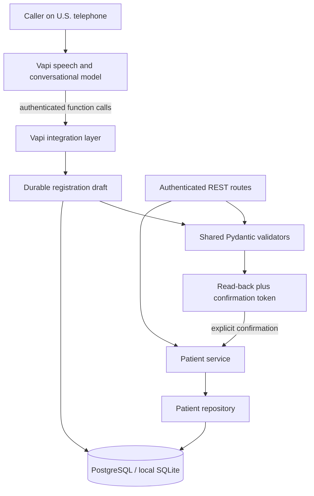

# Architecture

## Separation of concerns

API routes parse HTTP and return consistent envelopes. Pydantic owns patient types;
shared per-field TypeAdapters let partial REST updates and incomplete voice drafts
use exactly the same validation as final creates. Validators normalize dates, names,
phone numbers, states and ZIPs. Services enforce duplicate and active-record rules.
Repositories own parameterized queries. Provider request parsing and response shapes
exist only in `app/voice` and the thin voice route.

## Call flow and confirmation

1. Vapi greets the caller and extracts any supplied demographics into `collect_fields`.
2. The backend merges valid values into a draft identified by the provider call ID.
   Invalid corrections remove the old field and preserve the new error so an old
   value cannot accidentally be confirmed. Other fields remain intact.
3. Required-field refusals are counted; the second refusal cancels the draft.
   Start-over clears all demographic state, update selection, errors and consent.
4. After optional fields are offered, `prepare_confirmation` validates the whole
   draft, checks duplicates, and returns full read-back text and a fresh random token.
   The webhook first checks Vapi's live `artifact.messages` for the five optional
   categories, an invitation to add them, and a subsequent caller reply. Missing
   transcript evidence fails closed; a tool argument claiming the offer happened
   cannot bypass this check. Start-over requires a fresh offer. This is a text
   sequence check, not an independent audio or semantic verifier.
5. The assistant reads this aloud and waits. Save tools require an allowed explicit
   consent phrase, current token and matching operation/selected patient.
6. Patient mutation and the saved session marker commit in one transaction. Only
   after commit is success returned to Vapi. A failed commit rolls both back.
7. The assistant announces success and offers optional mock booking, then uses `endCall`. End events clear draft
   demographics and close the session. A late save after closure is rejected.

Conversational interpretation is deliberately delegated to the model; data validity
and the draft/confirmation state transition are enforced by code. The server trusts
the authenticated assistant to report the caller's actual response. It is not an
independent audio consent verifier. API/admin creates are a separate authorized path.

## Persistence and concurrency

`patients` uses UUIDs, SQL DATE, UTC timestamps and nullable `deleted_at`. SQLite
does not preserve timezone metadata, so its result adapter restores UTC. Production
requires PostgreSQL. Alembic creates both patient and registration tables from an
empty database; API imports do not create schema. File SQLite is restart-persistent.

Soft deletion updates timestamps; every normal repository query filters deleted
rows. A partial unique index reserves phone numbers only for active patients.
Service duplicate checks produce friendly errors; the index protects races.
Duplicate updates require a caller decision and re-confirmation, never an automatic
upsert. Lookup returns only the matching ID/name until the update is accepted.

Registration rows use PostgreSQL row locking and SQLAlchemy optimistic versioning.
Conflicting mutations fail rather than silently replace another draft. Successful
save retries return the already-associated patient instead of inserting again.
This is one registration per call; start another call for another patient. End
events may arrive more than once safely. Missed end events leave non-patient drafts
for a future retention job. Active phone uniqueness limits shared-household numbers.

## Errors and logging

REST uses `data/error` envelopes for application, validation, framework and database
errors. Voice tool responses intentionally use Vapi's `results` array, matching each
toolCallId and JSON-encoding each result as a string. Tool errors stay HTTP 200 for
Vapi processing; invalid webhook authentication uses 401 and malformed envelopes 422.
Field errors support targeted re-prompts. Persistence failures produce a safe message
and never a successful save result. Logs include call IDs, event types and error
classes without SQL parameters, API keys or authorization headers.

## Deployment and trade-offs

Railway builds the Dockerfile and supplies PORT. Startup applies migrations before
serving, with one replica recommended. PostgreSQL is a separate persistent service.
Vapi sends HTTPS webhooks to the public backend. The Vapi setup script checks backend
connectivity before creating/updating the specified assistant and phone association.

No task queue, Redis, frontend build or separate LLM server is necessary. Drafts use
JSON to keep multi-field voice updates simple. The dashboard is plain HTML/CSS/JS
served by FastAPI; no frontend build or external CDN dependency is needed.
The Railway Docker build, PostgreSQL runtime and production HTTP/webhook flows have
been verified. Real inbound audio remains an explicit acceptance step.

## Why these choices

| Decision | Benefit | Trade-off |
| --- | --- | --- |
| Vapi with GPT-4o-mini, Deepgram and a managed voice | Fast integration of speech, telephony and tools | Provider cost/dependency; recognition and model instruction-following remain imperfect |
| FastAPI and shared Pydantic validators | Clear schemas, Swagger and consistent API/voice rules | Some rules live in the application rather than SQL constraints |
| PostgreSQL in deployment, SQLite locally | Durable hosted data with simple local setup | Local tests do not replace PostgreSQL or telephone acceptance |
| Shared service layer for REST and voice | One set of persistence and duplicate rules | Provider integration must translate its own error envelope |
| Durable JSON draft plus confirmation token | Corrections and interrupted collection do not create patients | Model still reports caller intent; transcript checks are not independent audio verification |
| Unique active phone | Simple returning-patient detection and race protection | Shared family phone numbers cannot identify separate active records |
| One API replica, migrations on startup | Simple deployment for the assessment | Multi-replica production needs coordinated migrations |

## Code and prompt navigation

`app/api` owns HTTP routes/authentication; `schemas` and `validators` own data rules;
`services` and `repositories` own persistence; `voice` owns provider protocol and
conversation state. `models` and `alembic` define storage. `tests` exercise the layers.

The [system prompt](app/voice/prompts/patient_registration_system.md) is checked in
as readable Markdown. Its labeled sections explain each behavior and include spoken
examples, correction handling, edit permission versus save consent, and failure recovery.
[configuration.py](app/voice/configuration.py) defines the tools, model and speech
messages. A request-complete system hint examines the actual save result before
guiding completion; it is not an unconditional success message. Spoken adherence
still requires testing. The redacted preview is for review, not a credential source.

## Deliberate boundaries

- API access uses one shared reviewer key, not per-user authorization. No rate limiting,
  identity verification or healthcare compliance is claimed. Use fictional records.
- Validation checks phone/address formats, not ownership, assignment or geographic accuracy.
- Final fake payloads are logged to satisfy the assessment. Audio recording is disabled;
  Vapi may retain transcripts under its account settings. Patient-linked transcript
  storage is not implemented in our database.
- End events clear drafts. Missed events can leave unfinished drafts; a retention job
  is deferred. Patient lists are unpaginated.
- Three rejected saves or edit-permission attempts cancel the draft and request endCall.
  The backend blocks further writes; physical hangup still relies on Vapi.
- Nullable optional fields support removal; preferred_language stays nonblank and
  defaults to English. A language preference does not switch the speech pipeline.
- Multilingual conversation and patient-linked transcript storage remain deferred.

## Dashboard and mock appointments

The public `/dashboard` shell contains no patient data. Authenticated same-origin
fetches load records, details and appointments; the key stays in page memory, not
local storage or URLs. Patient values use `textContent` to avoid HTML injection.
This is a shared reviewer/admin interface with client-side search and no pagination.

`AppointmentService` is shared by REST and voice. One mock clinic offers weekday
half-hour slots from 14:00 to 20:00 UTC for 14 calendar days including today.
Availability is calculated from the clock and active reservations. An active-slot
partial unique index prevents double booking even under concurrent requests. A
cancelled row remains as history while its slot becomes reusable. Patient deletion
locks the patient and cancels future visits in the same transaction; booking takes
the same patient lock. No external calendar, holidays, providers or reminders exist.
UTC is deliberate: no implied U.S. local timezone or DST conversion. Real scheduling
would need clinic timezone, provider calendars, opening exceptions and stronger access controls.

Voice booking has separate durable selection, slot and consent-token fields in the
registration session. A newly saved patient is already selected. Booking-only
returning callers match phone plus DOB, without loading an edit draft. This is a
demo match, not strong identity verification. Prepare validates live availability
and returns a fresh read-back/token; booking requires that token and explicit consent.
Patient registration consent cannot authorize an appointment. Commit precedes success;
retries return the existing booking. Three rejected booking confirmations block more
booking tools. Closing the call clears pending booking state but retains saved records.
The model still reports the caller's speech and is responsible for reading back the
slot and waiting. Cancellation is REST/dashboard only; one appointment per voice call.
